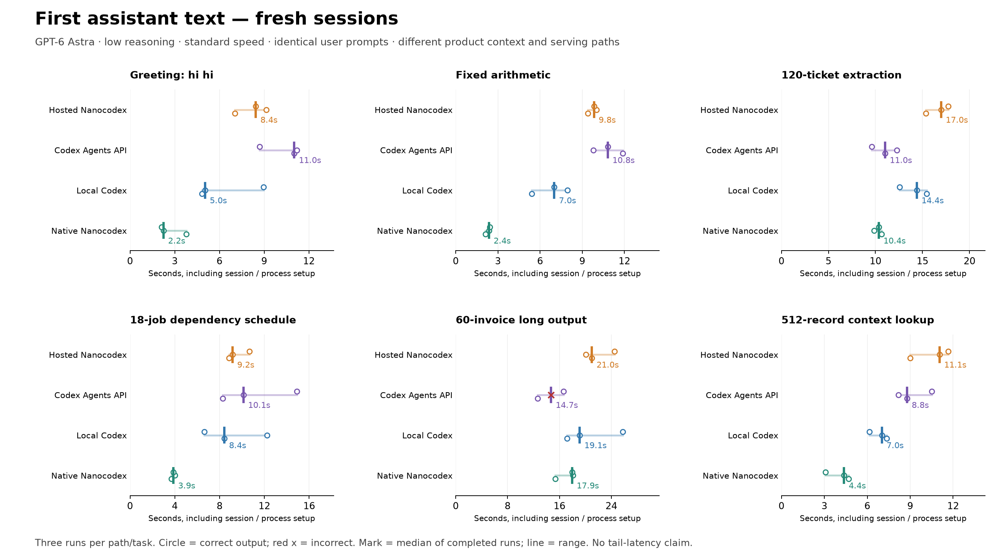
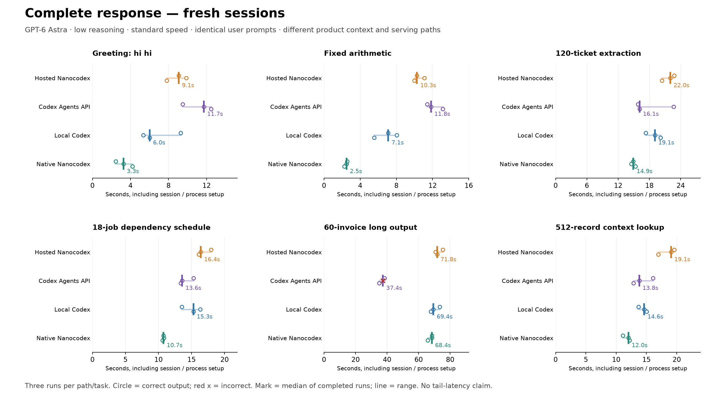

# Four-way Astra rebenchmark after managed startup changes

Run: **2026-09-16T02:20:57.683Z – 2026-09-16T03:09:52.458Z UTC**. Status: **complete**. Completed turns: **144/144**. Correct outputs: **142/144**.

The existing benchmark API credential was verified with HTTP 200. No credential value is stored in these artifacts. Hosted finite HTTP calls use the current SDK access-token cache; the earlier benchmark used raw authenticated HTTP. WebSocket authentication remains live. This compares the current product paths and does not isolate a single code change.

## Findings

- **Native Nanocodex has the lowest fresh-session first-text median on five of six workloads.** Agents API is fastest on the long invoice output. Hosted Nanocodex remains slower than local Codex for fresh-session first text on all six workloads.
- **Hosted follow-ups are much closer to Codex.** Hosted versus Codex median first text: extraction **2.01 vs 2.69 s**, invoices **2.75 vs 3.52 s**, greeting **2.31 vs 2.16 s**, schedule **3.70 vs 3.19 s**, long context **3.85 vs 3.62 s**, arithmetic **3.56 vs 1.98 s**. These are three observations per cell, not universal rankings.
- **Fresh hosted admission improved; follow-up admission did not materially change.** Across the same balanced suite, saved server-history admission medians are **1,155.5 → 601 ms fresh**, and **262 → 278.5 ms follow-up**. Hosted setup is **3,878 → 3,331 ms**. End-to-end improvements cannot all be attributed to our changes: unchanged CLI binaries also produced different latencies, and hosted HTTP now uses the current SDK access-token cache.
- **The auth fast path is working for prompt submission.** All **36/36 POST turns** used access authorization, reported as **0.0 ms** in Server-Timing (rounded precision). Their full client header latency was **111 ms median**, range **68–645 ms**. New-session requests sometimes renewed live auth; those ten requests reported **197 ms median** auth. This does not measure WebSocket auth separately.
- **Personalization no longer introduces the old recall spans in the captured traces.** Detailed logs cover **34/36 hosted turns**: **33 cache hits and one miss**. The miss was invoice repetition 3 / follow-up (`6782575b-6379-429c-a227-a0ee04ecec69`); it pinned **zero facts**, had **455 ms admission**, and proceeded with no automatic recall span. Its client first text was **3.68 s**. Missing live logs for two turns are explicitly retained as a coverage gap; saved admission/model boundaries exist for all 36.
- **Output delivery is a separate, larger cost for long answers.** The 60-invoice streaming interval is approximately **50.2 s** on hosted Nanocodex, Codex, and native Nanocodex, versus **16.1–17.9 s** on Agents API. Approximate delivered visible tokens/s are **33–34 vs 94–104**. Agents API also has a **4.3–4.6 s** median completion tail. These are client delivery measurements, not GPU decoding rates or proof of identical upstream scheduling.
- **Correctness:** hosted Nanocodex, Codex, and native Nanocodex each passed **36/36**. Agents API passed **34/36**: one fresh invoice answer had the wrong grand total and the follow-up repeated it. All 144 turns completed; no runner restart, observed hosted/native model retry, tool invocation, or first-text-from-done fallback was recorded. Five Agents usage records remained unavailable and are not treated as zero.

### Where the measured time goes

These medians pool the fixed six-workload suite. Components are measured independently and are not an additive latency budget.

| Priority by measured duration | Current observation | What it establishes |
| --- | --- | --- |
| Long-answer text delivery | About **50.2 s** on the three subscription paths for the invoice task | Dominates completion time there; small admission changes cannot remove it |
| Hosted model call → first text | **5.87 s fresh / 2.32 s follow-up**; workload medians vary substantially | Largest pre-text interval; includes upstream transport, queueing and reasoning, whose individual costs are not exposed |
| Hosted session + stream setup | **3.33 s** median; agent creation **1.96 s**, creation-to-ready phase **1.22 s** | Largest separately measured fresh-session product overhead; compare Codex setup **0.96 s** and native `run.started` **0.334 s**, with different boundaries |
| Hosted admission | **0.601 s fresh / 0.279 s follow-up** | Smaller now; fresh environment/catalog/vault spans overlap, and follow-up hosted-tool preparation is about **0.277 s** |
| Prompt HTTP authorization | Reported **0.0 ms** for all 36 submissions | Repeating the broad permission lookup is no longer the measured prompt-submit bottleneck |

The next targeted experiment should split and reduce creation-to-ready work and repeated hosted-tool preparation. It should separately test whether a smaller hosted instruction/tool context changes model wait: even the greeting uses about **18.1k input tokens hosted**, **15.6k Codex**, and **7.4k native Nanocodex**. This run shows those differences but does not quantify a causal saving from removing any particular token or lookup.

No new SQL-statement ranking is claimed: this run records logical admission reads (fresh **17 state + 2 initialization-ownership**, follow-up median **9 state**) but does not enable SQL-level tracing. It also does not remeasure voice, tool execution, or forced cold containers.

## Experiment

- Four paths: deployed hosted Nanocodex, OpenAI Codex Agents API, installed local Codex app-server, and installed native Nanocodex CLI.
- Model alias `gpt-6-astra`, reasoning effort `low`, standard/default speed. Local and hosted Nanocodex use standard reasoning mode. No pro mode is requested.
- Three fresh-session/follow-up pairs per path and workload; 144 total planned turns. Path order is shuffled within each workload and repetition using seed `20260915`. Model calls are sequential, not intentionally overlapped.
- Exact user-prompt bytes match across all paths. Prompt text, hashes and deterministic answer oracles are saved in `main.json`.
- Each follow-up repeats the complete same prompt in the same conversation. It retains the previous answer and repeats the supplied data. It therefore measures a repeated conversational task, **not an isolated cache-only intervention**. A lower cached-token fraction on long repeats can reflect newly appended input.
- Product-added system instructions, tools, serving endpoints, and authentication differ. Native optional integrations are disabled; Codex retains global AGENTS and its computer-use plugin; hosted Nanocodex uses deployed defaults; Agents has environment none and no configured extra tools; built-in harness tools may still exist. Invocation logs are checked separately. Token counts document these differences. This is a comparison of these configurations, not identical full upstream request bodies.
- Only three observations per cell: medians and observed ranges are descriptive. No p95, p99, statistical-significance, or universal speedup claim is made. The earlier 120-turn run and pilot are not pooled into this run.

## Workloads

| Workload | What it measures | Output check |
| --- | --- | --- |
| greeting | Original `hi hi` control | Nonempty reply; wording varies |
| arithmetic | Original fixed short-output control | Exactly `42` |
| extraction | Filter 120 tickets, preserve ID order, aggregate regional counts/minutes | Complete JSON equality |
| schedule | Earliest-start schedule for 18 jobs with dependencies and unlimited workers | All start/finish times and makespan |
| long_output | Expand all 60 invoices and calculate line/grand totals | All records, fields and numeric totals; no abbreviation |
| long_context | Read 512 records, retrieve 12 scattered queries in specified order, count active results | Exact IDs, opaque codes, weights and count |

## Fresh sessions: time to first text and completion

Every cell is **median first text / median completion, seconds**, including session/process creation and stream setup. Latencies include all completed runs, including incorrect outputs; consult the correctness table. Separate medians are shown; their difference is not a measured median generation duration. Agents conversation-only sessions require initial input, so its creation and first turn cannot be separated through this API.

| Workload | Hosted Nanocodex | Codex Agents API | Local Codex | Native Nanocodex |
| --- | ---: | ---: | ---: | ---: |
| greeting | 8.44 / 9.06 | 11.02 / 11.71 | 5.04 / 6.03 | 2.25 / 3.26 |
| arithmetic | 9.84 / 10.27 | 10.82 / 11.83 | 7.01 / 7.10 | 2.37 / 2.49 |
| extraction | 16.98 / 22.00 | 11.03 / 16.13 | 14.41 / 19.08 | 10.36 / 14.91 |
| schedule | 9.16 / 16.41 | 10.13 / 13.58 | 8.43 / 15.29 | 3.88 / 10.74 |
| long_output | 21.00 / 71.76 | 14.71 / 37.38 | 19.13 / 69.39 | 17.94 / 68.36 |
| long_context | 11.05 / 19.05 | 8.78 / 13.81 | 7.02 / 14.62 | 4.38 / 12.02 |

## Follow-ups: first text and completion

Every cell is **median first text / median completion, seconds**, with each stream connected before submitting the prompt. Native CLI values use its previous-completion-to-next-text boundary, explained below. Agents stream reconnection is measured separately and excluded from this table.

| Workload | Hosted Nanocodex | Codex Agents API | Local Codex | Native Nanocodex† |
| --- | ---: | ---: | ---: | ---: |
| greeting | 2.31 / 2.61 | 6.63 / 7.36 | 2.16 / 2.38 | 2.47 / 2.91 |
| arithmetic | 3.56 / 3.73 | 7.47 / 8.66 | 1.98 / 2.14 | 1.71 / 1.93 |
| extraction | 2.01 / 6.79 | 6.30 / 9.17 | 2.69 / 7.57 | 1.44 / 6.16 |
| schedule | 3.70 / 10.70 | 6.62 / 10.60 | 3.19 / 10.06 | 3.33 / 10.20 |
| long_output | 2.75 / 53.23 | 5.63 / 26.24 | 3.52 / 53.92 | 2.76 / 52.78 |
| long_context | 3.85 / 11.60 | 5.64 / 11.14 | 3.62 / 11.27 | 2.93 / 10.60 |

## Correctness

| Workload | Hosted | Agents API | Codex | Native Nanocodex |
| --- | ---: | ---: | ---: | ---: |
| greeting | 6/6 | 6/6 | 6/6 | 6/6 |
| arithmetic | 6/6 | 6/6 | 6/6 | 6/6 |
| extraction | 6/6 | 6/6 | 6/6 | 6/6 |
| schedule | 6/6 | 6/6 | 6/6 | 6/6 |
| long_output | 6/6 | 4/6 | 6/6 | 6/6 |
| long_context | 6/6 | 6/6 | 6/6 | 6/6 |

Scores combine fresh and follow-up outputs; follow-ups are not independent task-solving trials. JSON object key order is ignored; array order and values must match. Markdown fences and extra prose fail the explicit JSON-only requirement.

### Failed output checks

- Codex Agents API / long_output / repetition 2 / fresh_session: completed but failed the deterministic output check. Wrong fields: `grand_total_cents`. Grand total: `125125`, expected `124778`.
- Codex Agents API / long_output / repetition 2 / followup: completed but failed the deterministic output check. Wrong fields: `grand_total_cents`. Grand total: `125125`, expected `124778`.

## Hosted first-text breakdown

Medians in seconds. Session setup is measured by the client. Startup is server `turn_accepted` to `model.call.started`; model wait is `model.call.started` to first `assistant.delta`. The latter includes upstream networking, queueing and reasoning, not only model prefill. These are separately aggregated medians, so they need not add to median client TTFT. Event timestamps do not identify individual Cloudflare service hops.

| Workload / state | Session + stream setup | Server startup | Model call to first text | Client submission to first text |
| --- | ---: | ---: | ---: | ---: |
| greeting / fresh_session | 2.78 | 0.57 | 5.21 | 5.86 |
| greeting / followup | 0.00 | 0.28 | 1.95 | 2.31 |
| arithmetic / fresh_session | 3.42 | 0.64 | 5.61 | 6.32 |
| arithmetic / followup | 0.00 | 0.26 | 3.26 | 3.56 |
| extraction / fresh_session | 2.77 | 0.54 | 13.32 | 14.00 |
| extraction / followup | 0.00 | 0.28 | 1.70 | 2.01 |
| schedule / fresh_session | 3.49 | 0.69 | 5.61 | 6.51 |
| schedule / followup | 0.00 | 0.28 | 3.36 | 3.70 |
| long_output / fresh_session | 3.15 | 0.48 | 17.44 | 17.92 |
| long_output / followup | 0.00 | 0.27 | 2.38 | 2.75 |
| long_context / fresh_session | 3.95 | 0.72 | 6.14 | 7.10 |
| long_context / followup | 0.00 | 0.31 | 3.39 | 3.85 |

### Hosted setup and admission stages

Pooled across this fixed six-workload suite. Values are median milliseconds (observed minimum–maximum); these stages overlap, especially catalog/discovery/vault, and must not be added together.

| Boundary or stage | Fresh session | Follow-up |
| --- | ---: | ---: |
| Agent creation | 1964 (1208–2707; n=18) | 0 (0–0; n=18) |
| Creation-to-WebSocket-ready phase† | 1221 (319–2161; n=18) | 0 (0–0; n=18) |
| Admission from saved turn history | 601 (420–765; n=18) | 278 (250–496; n=18) |
| `account.hosted_tools` | 413 (256–557; n=17) | 277 (250–496; n=17) |
| `account.catalog` | 577 (415–724; n=17) | unavailable |
| `account.mcp_discovery` | 577 (415–724; n=17) | 206 (176–473; n=17) |
| `account.vault` | 594 (420–765; n=17) | unavailable |
| `startup.environment` | 594 (420–765; n=17) | unavailable |

Detailed live stage logs cover **34/36 hosted turns**. The collector reported a reconnect; missing detailed spans remain unknown. Saved turn-history admission/model boundaries are retained independently. Observed personalization pins: **33/34 cache hits**; observed automatic recall spans: **0**.

† The creation-to-ready phase includes the local session-ID checkpoint before opening the WebSocket; it is not an isolated handshake timer.

### Hosted HTTP authorization

Client header latency includes the full request path. Auth duration is the server-reported `managed_auth` component; 0.0 ms is its reported precision, not proof of literally zero work. WebSocket authentication is separate and remains live.

| Request | Auth mode | Count | Header latency, ms | Auth time, ms |
| --- | --- | ---: | ---: | ---: |
| POST `/v1/agents` | access | 8 | 2010 (1208–2706; n=8) | 0 (0–0; n=8) |
| POST `/v1/agents` | live | 10 | 1964 (1497–2557; n=10) | 197 (190–207; n=10) |
| POST `/v1/agents/:id/turns` | access | 36 | 111 (68–645; n=36) | 0 (0–0; n=36) |

### Read counters and SQL coverage

Admission traces include logical read counters. They are **not SQL execution counts, rows scanned, or individual SELECT timings**. SQL-level tracing was not enabled for this benchmark; no SQL result from the earlier run is substituted here.

| Logical read | Fresh count per traced turn | Follow-up count per traced turn |
| --- | ---: | ---: |
| `session_initialization_ownership` | 2 (2–2; n=17) | unavailable |
| `session_state` | 17 (17–17; n=17) | 9 (9–12; n=17) |

### Local protocol boundaries

Median milliseconds (observed range), except connection counts. Local stage boundaries use client event receipt and include delivery/checkpoint effects; they are not isolated internal CPU timings. Native follow-up clocks retain the previous-completion caveat. Native connection timing comes from `model.connection.completed`; absence of a new connection on a repeat is reported as a connection count of zero, not a measured zero-duration handshake.

| Path / state | Process or session setup | Boundary to model call / turn-started | Call / turn-started to text | Native connection count | Native connection duration |
| --- | ---: | ---: | ---: | ---: | ---: |
| nanocodex/fresh_session | 334 (34–380; n=18) | 340 (37–386; n=18) | 3595 (1883–17702; n=18) | 1 (1–1; n=18) | 531 (484–723; n=18) |
| nanocodex/followup | 0 (0–0; n=18) | 185 (3–695; n=18) | 2345 (1082–3955; n=18) | 0 (0–0; n=18) | unavailable |
| codex/fresh_session | 960 (497–8433; n=18) | 6 (5–18; n=18) | 6740 (3478–17801; n=18) | unavailable | unavailable |
| codex/followup | 0 (0–0; n=18) | 23 (16–226; n=18) | 2765 (1822–4724; n=18) | unavailable | unavailable |

## Cached input across workloads

Each cell is **fresh / follow-up cached input share**, weighted by input tokens over known-usage rows. This is the fraction of tokens read from cache, not the fraction of requests that received a hit. Exact counts and usage coverage are in `text-summary.json`; unavailable usage is excluded, never counted as zero.

| Workload | Hosted | Agents API | Codex | Native Nanocodex |
| --- | ---: | ---: | ---: | ---: |
| greeting | 0.0% / 98.9% | 0.0% / 99.7% | 0.0% / 88.8% | 27.6% / 96.5% |
| arithmetic | 79.0% / 98.8% | 0.0% / 99.6% | 65.6% / 84.9% | 0.0% / 98.0% |
| extraction | 0.0% / 57.7% | 0.0% / 76.3% | 24.7% / 81.6% | 44.2% / 75.3% |
| schedule | 56.4% / 95.9% | 0.0% / 92.2% | 28.1% / 90.3% | 0.0% / 60.0% |
| long_output | 77.6% / 84.3% | 0.0% / 71.3% | 0.0% / 61.1% | 0.0% / 69.8% |
| long_context | 37.5% / 68.4% | 0.0% / 59.4% | 15.9% / 64.1% | 9.3% / 59.1% |

## Input context size

Median reported input tokens in fresh sessions. The same user prompt acquires different product instructions and tool definitions; these token counts are evidence of that confound. Prompt character counts are not token counts.

| Workload | User prompt characters | Hosted input tokens | Agents input tokens | Codex input tokens | Native input tokens |
| --- | ---: | ---: | ---: | ---: | ---: |
| greeting | 5 | 18092.00 | 7204.00 | 15601.00 | 7407.00 |
| arithmetic | 51 | 18104.00 | 7216.00 | 15613.00 | 7419.00 |
| extraction | 8982 | 20730.00 | 9842.00 | 18904.00 | 10045.00 |
| schedule | 1302 | 18443.00 | 7555.00 | 16617.00 | 7758.00 |
| long_output | 4275 | 19452.00 | 8564.00 | 16961.00 | 8767.00 |
| long_context | 39732 | 32777.00 | 21889.00 | 30286.00 | 22092.00 |

## Long-output delivery

These rates describe received output. Approximate visible token rate is `(reported output tokens − reported reasoning tokens) / (last text − first text)`; it includes the first chunk in the numerator and may include protocol-format tokens. It is **not a direct GPU decoding-rate measurement**. Single-chunk output has no meaningful streaming-rate estimate. Exact client characters/s excludes the first chunk.

| Path / state | Output tokens, median | Reasoning tokens | Streaming seconds | Approx. visible tokens/s | Client characters/s | First chunk characters | Completion tail, seconds | Usage rows |
| --- | ---: | ---: | ---: | ---: | ---: | ---: | ---: | ---: |
| Hosted Nanocodex / fresh_session | 2106.00 | 424.00 | 50.25 | 33.47 | 99.23 | 2.00 | 0.50 | 3/3 |
| Hosted Nanocodex / followup | 1680.00 | 0.00 | 50.25 | 33.43 | 99.22 | 2.00 | 0.22 | 3/3 |
| Codex Agents API / fresh_session | 2097.00 | 415.00 | 17.89 | 94.01 | 278.69 | 2.00 | 4.63 | 3/3 |
| Codex Agents API / followup | 1680.00 | 0.00 | 16.09 | 104.44 | 309.95 | 2.00 | 4.29 | 3/3 |
| Local Codex / fresh_session | 2063.00 | 381.00 | 50.16 | 33.53 | 99.40 | 2.00 | 0.14 | 3/3 |
| Local Codex / followup | 1680.00 | 0.00 | 50.26 | 33.43 | 99.20 | 2.00 | 0.12 | 3/3 |
| Local Nanocodex CLI / fresh_session | 2144.00 | 462.00 | 50.23 | 33.49 | 99.27 | 2.00 | 0.19 | 3/3 |
| Local Nanocodex CLI / followup | 1680.00 | 0.00 | 50.19 | 33.47 | 99.35 | 2.00 | 0.14 | 3/3 |

Completion tail is the client-observed time from the last text chunk to the terminal turn event. It is included in completion time; it is not part of the streaming interval.

## Long-context cache and input size

Cached percentage is total cached tokens divided by total input tokens over rows with known usage. Missing usage remains unknown. The second turn includes the first answer plus another full copy of the input data.

| Path / state | Input tokens, median | Uncached tokens, median | Cached input share (usage coverage) | First text, seconds |
| --- | ---: | ---: | ---: | ---: |
| Hosted Nanocodex / fresh_session | 32777.00 | 23305.00 | 37.5% (3/3 usage rows) | 11.05 |
| Hosted Nanocodex / followup | 47748.00 | 15108.00 | 68.4% (3/3 usage rows) | 3.85 |
| Codex Agents API / fresh_session | 21889.00 | 21889.00 | 0.0% (3/3 usage rows) | 8.78 |
| Codex Agents API / followup | 36860.00 | 14974.00 | 59.4% (3/3 usage rows) | 5.64 |
| Local Codex / fresh_session | 30286.00 | 30286.00 | 15.9% (3/3 usage rows) | 7.02 |
| Local Codex / followup | 47865.00 | 17785.00 | 64.1% (3/3 usage rows) | 3.62 |
| Local Nanocodex CLI / fresh_session | 22092.00 | 22092.00 | 9.3% (3/3 usage rows) | 4.38 |
| Local Nanocodex CLI / followup | 37061.00 | 15173.00 | 59.1% (3/3 usage rows) | 2.93 |

## Measurement boundaries and limitations

- Hosted turns use HTTP submission and a preconnected live WebSocket. Codex uses `turn/start` over its app-server JSON-RPC connection. Agents creates its first session with initial input and SSE; later turns use a preconnected SSE stream and HTTP submission.
- **† Native CLI follow-up:** installed `nanocodex run --repeat 2` submits internally. Its observed clock starts when the previous `run.completed` arrives, not at the exact internal next submission. Event delivery and CLI settlement can shift this boundary. Fresh CLI timing starts before process spawn; `run.started`-to-text is also retained as a separate metric.
- First text means the first nonempty assistant-text event received by the client, excluding reasoning/activity events; it does not measure the first token inside the provider. It can include commentary. `text-summary.json` separately reports first final-answer text where message IDs/phases permit it. UI rendering is excluded.
- Measurements ran on a shared workstation, not a controlled idle host. Client event handling and checkpoint overhead are included. In particular, the runner journals the first Agents session ID during its live stream and writes a checkpoint at native completion before processing subsequent events. Their overhead was not separately instrumented, so no provider-only latency is inferred.
- Follow-up gaps differ: native repetition is immediate; hosted/Codex adapters perform metadata/checkpoint work; Agents usage can arrive late and is polled. This may affect cache readiness and reduces the strength of cache-only causal comparisons.
- This uses an existing signed-in account with prepared personalization. It does not force an empty or expired personalization cache, a newly registered account, cold Worker isolates, or cold sandbox containers.
- A fresh session is not a forced cold cache. No global cache flush was attempted. Backend cache routes, shared load and model aliases are not pinned. Private model snapshot identities are unavailable.
- The Agents API and subscription-backed Codex endpoint use different authentication and serving paths. The same model alias and requested service tier do not prove identical server scheduling.
- Agents token usage is best-effort and can be absent or revised; it is retried before session deletion. Its API does not expose cache-write counts, so these data cannot establish exact billed model cost. [OpenAI usage documentation](https://developers.openai.com/api/docs/guides/agents-api/observability).
- Runtime versions, executable hashes and configuration notes are in `manifest.json`. Local native Nanocodex is the September 11 build; hosted deployment receipts identify the newly deployed service. This is not a same-build comparison.
- This suite exercises no-tool reasoning, structured transformation, long input and long output. It does not measure repository editing, tool execution or sandbox performance.

## Operational evidence

- Deployment metadata identical at start/end: **True**.
- Deployment-history audit covers the entire run for all four Workers: **zero deployments during the run**.
- Recorded hosted/Agents resources deleted: **36/36**.
- Temporary workspace removed: **True**.
- All synthetic session IDs and cleanup outcomes are journaled in raw results. Local Codex threads are ephemeral and native rollouts are disabled.
- This benchmark did not edit application source or deploy code. Other workspace work is outside this experiment.
- No runner interruption was recorded.

## Figures

## Published evidence

- [Synthetic workloads and answer oracles](workloads.json)
- [Per-turn timings](measurements.csv)
- [Per-cell medians and ranges](text-summary.json)
- [Component summaries](text-components.json)
- [Selected per-turn stage traces](text-stage-traces.json)
- [Independent validation](validation.json)
- [Runtime and experiment manifest](manifest.json)

Full raw events, actual product-added context, machine-specific harnesses and live Worker tails remain in local `output/ttft-rebenchmark-20260915/`. References to `main.json` in this report refer to that local archive. The earlier baseline is in local `output/ttft-extended-20260915/`.

## Earlier versus current hosted measurements

Seconds; previous and current runs occurred at different times. Same user workloads, CLI binaries and requested model settings; hosted context/auth handling changed. These are descriptive comparisons, not a randomized causal estimate.

| Workload | Fresh total first text, earlier → current | Follow-up first text, earlier → current | Fresh admission, earlier → current |
| --- | ---: | ---: | ---: |
| greeting | 11.75 → 8.44 | 4.03 → 2.31 | 1.17 → 0.57 |
| arithmetic | 9.98 → 9.84 | 4.93 → 3.56 | 1.14 → 0.64 |
| extraction | 16.72 → 16.98 | 4.35 → 2.01 | 1.43 → 0.54 |
| schedule | 10.72 → 9.16 | 2.94 → 3.70 | 1.14 → 0.69 |
| long_output | 26.72 → 21.00 | 3.35 → 2.75 | 1.11 → 0.48 |
| long_context | 12.10 → 11.05 | 3.86 → 3.85 | 1.18 → 0.72 |

### Fresh first text: earlier → current for all paths

Same six workloads and unchanged local executable hashes. Changes in the unchanged CLI results illustrate why the hosted before/after difference cannot all be assigned to our code change.

| Workload | Hosted | Agents API | Codex | Native Nanocodex |
| --- | ---: | ---: | ---: | ---: |
| greeting | 11.75 → 8.44 | 11.98 → 11.02 | 11.50 → 5.04 | 6.52 → 2.25 |
| arithmetic | 9.98 → 9.84 | 10.24 → 10.82 | 7.10 → 7.01 | 3.96 → 2.37 |
| extraction | 16.72 → 16.98 | 11.64 → 11.03 | 13.95 → 14.41 | 12.43 → 10.36 |
| schedule | 10.72 → 9.16 | 11.37 → 10.13 | 12.09 → 8.43 | 4.22 → 3.88 |
| long_output | 26.72 → 21.00 | 17.21 → 14.71 | 18.38 → 19.13 | 14.09 → 17.94 |
| long_context | 12.10 → 11.05 | 11.51 → 8.78 | 7.15 → 7.02 | 3.58 → 4.38 |