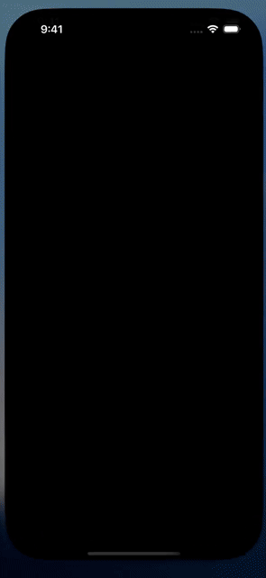

# Project chat and persistent task threads

Reference: [0xDesigner’s project chat](https://x.com/0xDesigner/status/2100679849249771839), [original walkthrough](https://x.com/0xDesigner/status/2092635269081989572), and [Boris Cherny’s quoted workflow](https://x.com/bcherny/status/2100669598995816511).

The mobile shell uses a project sidebar, a persistent master chat, compact project header, blue user bubbles, unboxed replies, and one composer. A live-task pill opens a native Tasks/Agents sheet. Tasks are durable child threads, with status and drill-down to their messages. Links beside the originating message open delegated work. Back, screens, captured context, connectors and scheduled jobs remain in the header menu.

New project creates a named home backed by a managed agent. Existing conversations remain project homes. Rename changes the navigation name; names persist locally per account. Server-owned parent/root/turn metadata groups spawned agents under their actual master across devices. Selecting a project returns to its master chat. Selecting an agent opens that member conversation. Sheets retain the master conversation and its draft; task detail subscribes to bounded background history while visible.

## Simulator recording

[Watch the iPhone simulator walkthrough](media/project-threads-ios.mp4) (iPhone 16 Pro, iOS 18.2).

The clip is trimmed from the passing XCTest journey. Static captures: [chat](media/project-chat.png), [tasks](media/project-tasks-sheet.png), [task detail](media/project-task-detail.png), [agents](media/project-agents-sheet.png), [sidebar](media/project-sidebar.png).

## Persistent delegation

- `spawn_project_thread({id, title, input})` starts a separate durable managed agent and admits its initial task. The child inherits the parent's configuration and invoking turn's capabilities. Connect grants cannot use this capability; disabled delegation remains disabled.
- A stable caller-selected ID produces the same child and turn on retry. A durable account-owned relationship rejects changed input or attempts to reparent a thread. Retrying after an ambiguous admission reuses the existing turn.
- `list_project_threads` returns scoped thread status; `read_project_thread` returns the admitted task and terminal result. The master uses those results to reply in the project chat. These differ from in-process `spawn_agent` subagents.
- Child context is explicit in `input`; no hidden transcript cloning occurs. Nested delegation stays in the same project. A project is bounded to 128 undeleted child threads.

The master decides which independent goals to delegate. This does not route every new message into a thread automatically. An idle master is not yet automatically awakened when a child completes: the master reads results while active or on the next follow-up. Project names remain device-local, and full shared project-memory policy is not introduced here.

The task sheet describes its loaded-history scope. Unknown historical outcomes are labelled History, never assumed successful. Task projections are cached across composer edits. Generated outputs remain in the full conversation; the detail sheet displays task messages.

## Validation

Five focused InboxCore tests cover server lineage parsing, real task identities/statuses, partial history, and local-to-server ID migration. Five backend tests cover durable project membership, nested roots, account boundaries, changed-input conflicts, retry after failed admission, and rejection of tool authority overrides. Type checking and a Worker-only Wrangler dry run pass. The unrelated connector-provider catalog test fails because its expected list omits Link; the same failure was reproduced against unchanged HEAD.

Six simulator tests pass (two new project journeys and four drawer/menu/back-navigation regressions). The new tests verify: Tasks/Agents navigation retains the draft, and a named project survives app relaunch. The simulator journey uses explicitly opted-in Debug fixtures with representative master/child conversations. It verifies navigation and draft preservation; it does not claim a live model chose to delegate. Signed-device delivery and production deployment are not part of this PR.
